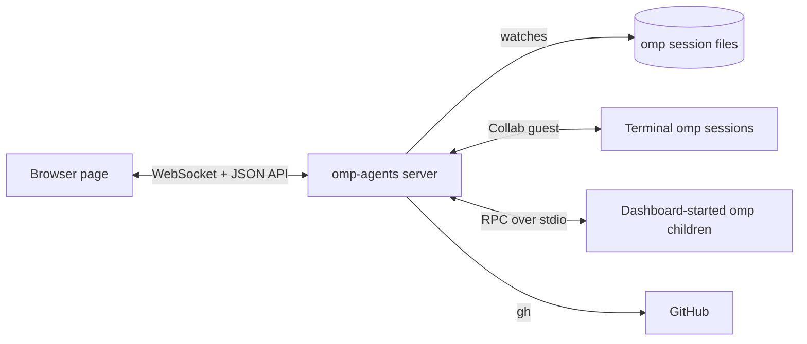

# omp-agents

A local web dashboard for every [omp](https://omp.sh) session and subagent on your machine.

[](LICENSE)
[](https://bun.sh)
[](https://www.npmjs.com/package/@oh-my-pi/pi-coding-agent)

omp-agents lists the sessions that run in your terminals and the ones it starts itself, streams each conversation as it happens, and lets you message, steer, interrupt, resume, or fork any of them from one browser tab.
It reads omp's own session files and speaks omp's own protocols through omp's installed modules, so it stays in step with the omp version you run.

## Contents

- [Features](#features)
- [Requirements](#requirements)
- [Quick start](#quick-start)
- [Configuration](#configuration)
- [Usage](#usage)
- [How it works](#how-it-works)
- [Security](#security)
- [Contributing](#contributing)
- [License](#license)

## Features

- **Live roster.**
  Every running and past session, with a status dot (running, idle, or waiting on a question), filtered by project.
  Pin a session to keep it at the top.
  Sessions that stopped when the dashboard went down wait in an **interrupted** group, and **Resume all** brings them back.
- **Session details.**
  The focused conversation's todo list, the files its agent changed with each file's latest diff, the live session's subagents as a tree, and every screenshot and image its agents' tools returned; subagents also open from the `task` call that spawned them, and a back arrow returns to the session.
- **Live conversations.**
  Streaming Markdown transcripts, tool calls, and context-window usage, in up to four split panes.
- **Full control.**
  Prompt, with images attached, dropped, or pasted, steer, queue follow-ups, interrupt, answer `ask` questions and extension dialogs, message and cancel subagents, run `!` shell and built-in `/` commands in a session the dashboard started, switch model and thinking level, end sessions.
- **Next-prompt suggestions.**
  When omp ends a reply with a `Suggestions:` block, as the starter kit's system prompt asks it to, the composer lists them; press a number key to send one, or pick one with ↓ and ↑.
- **Session lifecycle.**
  Start a session in any project, on any branch or a new one in its own git worktree, resume a past one, or fork a conversation from any prompt or reply.
  An agent can end its own session and remove its worktree through the starter kit's `end_session` tool, so "Merge on main, delete the worktree, then end the session" needs no follow-up.
- **Pull request inbox.**
  A Graphite-style inbox of your GitHub pull requests, linked to the sessions that submitted or worked on them.
- **Linear tickets.**
  The Linear issues assigned to you, grouped by workflow state like Linear's My issues, read through omp's Linear MCP sign-in.
  Click one to read it in full, and start a session that works on it or plans it.
- **Your own todo list.**
  Categories, due days with a Today list, drag-to-reorder, search, and an archive with undo.
  A todo links to the sessions, pull requests, and Linear issues it is about, starts a session or opens a Linear issue from its notes, and agents add the steps only you can take through the starter kit's `user_todo` tool and check off a todo once they finish its work.
  The desktop app captures a todo from any app and badges the Dock with what is left.
- **Settings editor.**
  Edit omp's model roles, fallback chains, retry settings, and context files (`AGENTS.md`, `config.yml`, skills, rules) in place, and pin a skill that every new session starts through.
- **Plan quota.**
  Remaining quota per provider plan, from `omp usage`.
- **Keyboard-first.**
  Shortcuts that follow omp's terminal keys; press `?` to list them.
- **omp starter kit.**
  An optional, ready-made omp setup (model routing, agent rules, a review agent, a `/ship` workflow, skills) that one command installs.

## Requirements

- [Bun](https://bun.sh) 1.4 or later.
  Tested with Bun 1.4.2.
- omp installed with Bun and on your `PATH`.
  Tested with omp 18.4.10.

  ```sh
  bun install -g @oh-my-pi/pi-coding-agent
  ```

- Optional, for the pull request inbox: the [GitHub CLI](https://cli.github.com) (`gh`), signed in with `gh auth login`.
- Optional, for the Linear tickets: Linear's MCP server added to omp (`/mcp add` with `https://mcp.linear.app/mcp`) and signed in.

## Quick start

```sh
git clone https://github.com/MaisonnatM/omp-agents.git
cd omp-agents
bun install --frozen-lockfile
bun start
```

On start, the server prints a sign-in address, `http://127.0.0.1:4317/?token=<token>`.
Open it once: it signs the browser in with a cookie, and from then on <http://127.0.0.1:4317> works in that browser.
Sessions that the dashboard starts appear right away.
To also see the sessions you start in a terminal, enable [Collab auto-start](#show-terminal-sessions).

### Desktop app

To use the dashboard in its own window instead of a browser tab, run it from the clone:

```sh
bun run desktop
```

The first run downloads Electron into `desktop/node_modules`, about 100 MB.
The app is not packaged or signed; it runs from this checkout, so a `git pull` updates it.
It signs itself in, so it needs no token from you.

- If an omp-agents server already listens on the port, for example a `bun start` in another terminal, the window uses that server and leaves it running when you quit.
  Otherwise the app starts the server and stops it, with every session that the dashboard started, when you quit.
- On macOS, closing the window (Cmd+W) hides it and keeps the server and its sessions running; click the app in the Dock to show it again.
  Cmd+Q quits.
- On macOS, **Open at Login** in the app menu starts the app, and with it your routines, when you log in.
- Links to GitHub, Graphite, Linear, and every other site open in your default browser.
- `PORT` works as for `bun start`.
  A browser tab on the same address keeps working alongside the window.

## Configuration

### Show terminal sessions

Terminal sessions reach the dashboard through omp's local Collab registry.
Have omp publish each session it starts:

```sh
omp config set collab.autoStart control
```

Only sessions that start hosting after the change appear.
Restart a session that was already running, or run `/new` or `/collab` inside it.
With `view` instead of `control`, the dashboard shows those sessions read-only.

### Environment variables

| Variable | Default | Purpose |
| --- | --- | --- |
| `PORT` | `4317` | Port the server listens on, always on `127.0.0.1`. |
| `OMP_PACKAGE_DIR` | resolved from `omp` on `PATH` | The installed `@oh-my-pi/pi-coding-agent` directory. Set it when `omp` is not on your `PATH`, or resolves to a build that does not ship its sources. |

```sh
PORT=5000 bun start
```

### omp starter kit

[`templates/omp`](templates/omp) holds the omp setup this project is built with: model roles and fallback chains across Anthropic, OpenAI Codex, Cursor, and OpenRouter, an `AGENTS.md`, a review agent, a `/ship` command, and skills.
It also turns on `collab.autoStart`.
Install it with:

```sh
bun run omp-template --dry-run   # list what would change
bun run omp-template
bun run omp-template --maintainer
```

Pass `--maintainer` to also install the maintainer git profile.
That profile tells a session to push local `main`, to register Graphite branches, and to clean up worktrees.
The default install leaves it out.

Files and settings that you already have keep your version unless you pass `--force`.
See the [kit's README](templates/omp/README.md) for what it contains.

## Usage

Select a session in the left sidebar to read its conversation and message it.
Cmd-click (Ctrl-click on Linux and Windows) opens it in a split pane.
Click **+** to start a session, **Resume** to continue a past one, and **Fork from here** under a prompt or a reply to branch a conversation.
The **Inbox** tab shows your pull requests, the **Tickets** tab your Linear issues, and the gear button opens **Settings**.

While a turn runs, Enter steers it and Cmd+Enter (Ctrl+Enter on Linux and Windows) queues a follow-up, as in omp's terminal.
Esc interrupts the turn.

In a session the dashboard started, built-in `/` commands and `!<command>` run as they do in omp's terminal.
A terminal session cannot run them, because Collab accepts guest prompts and not host-side commands.
No session runs the `$` Python shortcut from the dashboard, and only the omp terminal runs `!!`.
The composer refuses a draft that starts with one of those and does not send it.

See [docs/usage.md](docs/usage.md) for the full interface reference, including every keyboard shortcut and URL format.

## How it works



- **Transcripts** come from omp's session files on disk, read incrementally as they grow.
  Live events only add what the file does not hold yet.
- **Terminal sessions** are joined as a Collab guest named `omp-agents`, the same way `omp join` does, for prompts, interrupts, questions, and subagent status.
- **Dashboard sessions** are omp child processes in RPC mode (`--mode rpc-ui`), spawned through omp's own `RpcClient`.

The server imports these protocols from your installed omp instead of reimplementing them.
Joining a terminal session makes it count `omp-agents` as one more participant and send its transcript snapshot and live events through its Collab relay (`collab.relayUrl`); see [why](docs/architecture.md#why-the-server-joins-every-terminal-session).

See [docs/architecture.md](docs/architecture.md) for the design, the HTTP API, and the code layout.

## Security

> [!WARNING]
> The agents run tools on your machine. The access token stops web pages and other user accounts, not a program that runs as you: it can read the token file. Run the dashboard only on a machine that you alone use, and never expose its port through a tunnel or a proxy.

The server listens on `127.0.0.1` only, keeps Collab links and room keys in memory, and requires an access token, kept in `~/.config/omp-agents/token` with mode `0600`, for the page, the WebSocket, and every `/api/` route.
Delete the file and restart to rotate it.
See [SECURITY.md](SECURITY.md) for the full threat model and how to report a vulnerability.

## Contributing

Bug reports and pull requests are welcome.
See [CONTRIBUTING.md](CONTRIBUTING.md) to set up a development environment and run the checks.

## License

[MIT](LICENSE) © 2026 Maxence Maisonnat
