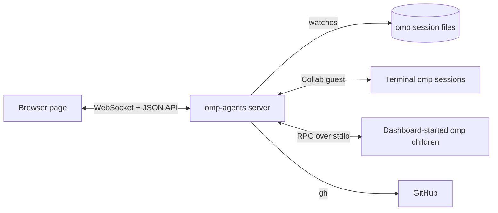

# omp-agents

A local web dashboard for every [omp](https://omp.sh) session and subagent on your machine.

[](LICENSE)
[](https://bun.sh)
[](https://www.npmjs.com/package/@oh-my-pi/pi-coding-agent)

omp-agents lists the sessions that run in your terminals and the ones it starts itself, streams each conversation as it happens, and lets you message, steer, interrupt, resume, or fork any of them from one browser tab. It reads omp's own session files and speaks omp's own protocols through omp's installed modules, so it stays in step with the omp version you run.

## Contents

- [Features](#features)
- [Requirements](#requirements)
- [Quick start](#quick-start)
- [Configuration](#configuration)
- [Usage](#usage)
- [How it works](#how-it-works)
- [Security](#security)
- [Contributing](#contributing)
- [License](#license)

## Features

- **Live roster.** Every running and past session, with a status dot (running, idle, or waiting on a question), filtered by project.
- **Subagent tree.** The subagents of the focused session, indented by parent, with their status and current activity.
- **Live conversations.** Streaming Markdown transcripts, tool calls, and context-window usage, in up to four split panes.
- **Full control.** Prompt, steer, queue follow-ups, interrupt, answer `ask` questions and extension dialogs, switch model and thinking level, end sessions.
- **Session lifecycle.** Start a session in any project, resume a past one, or fork a conversation from any prompt or reply.
- **Pull request inbox.** A Graphite-style inbox of your GitHub pull requests, linked to the sessions that submitted or worked on them.
- **Settings editor.** Edit omp's model roles, fallback chains, retry settings, and context files (`AGENTS.md`, `config.yml`, skills, rules) in place.
- **Plan quota.** Remaining quota per provider plan, from `omp usage`.
- **Keyboard-first.** Shortcuts that follow omp's terminal keys; press `?` to list them.
- **omp starter kit.** An optional, ready-made omp setup (model routing, agent rules, a review agent, a `/ship` workflow, skills) that one command installs.

## Requirements

- [Bun](https://bun.sh) 1.4 or later. Tested with Bun 1.4.2.
- omp installed with Bun and on your `PATH`. Tested with omp 18.4.8.

  ```sh
  bun install -g @oh-my-pi/pi-coding-agent
  ```

- Optional, for the pull request inbox: the [GitHub CLI](https://cli.github.com) (`gh`), signed in with `gh auth login`.

## Quick start

```sh
git clone https://github.com/MaisonnatM/omp-agents.git
cd omp-agents
bun install
bun start
```

Open <http://127.0.0.1:4317>. Sessions that the dashboard starts appear right away. To also see the sessions you start in a terminal, enable [Collab auto-start](#show-terminal-sessions).

## Configuration

### Show terminal sessions

Terminal sessions reach the dashboard through omp's local Collab registry. Have omp publish each session it starts:

```sh
omp config set collab.autoStart control
```

Only sessions that start hosting after the change appear. Restart a session that was already running, or run `/new` or `/collab` inside it. With `view` instead of `control`, the dashboard shows those sessions read-only.

### Environment variables

| Variable | Default | Purpose |
| --- | --- | --- |
| `PORT` | `4317` | Port the server listens on, always on `127.0.0.1`. |
| `OMP_PACKAGE_DIR` | resolved from `omp` on `PATH` | The installed `@oh-my-pi/pi-coding-agent` directory. Set it when `omp` is not on your `PATH`, or resolves to a build that does not ship its sources. |

```sh
PORT=5000 bun start
```

### omp starter kit

[`templates/omp`](templates/omp) holds the omp setup this project is built with: model roles and fallback chains across Anthropic, OpenAI Codex, Cursor, and OpenRouter, an `AGENTS.md`, a review agent, a `/ship` command, and skills. It also turns on `collab.autoStart`. Install it with:

```sh
bun run omp-template --dry-run   # list what would change
bun run omp-template
```

Files and settings that you already have keep your version unless you pass `--force`. See the [kit's README](templates/omp/README.md) for what it contains.

## Usage

Select a session in the left sidebar to read its conversation and message it. Cmd-click (Ctrl-click on Linux and Windows) opens it in a split pane. Click **+** to start a session, **Resume** to continue a past one, and **Fork from here** under a prompt or a reply to branch a conversation. The **Inbox** tab shows your pull requests, and the gear button opens **Settings**.

While a turn runs, Enter steers it and Cmd+Enter (Ctrl+Enter on Linux and Windows) queues a follow-up, as in omp's terminal. Esc interrupts the turn.

The dashboard cannot run omp's built-in `/` commands, the `$` Python shortcut, or the `!` shell shortcut; run those in the omp terminal.

See [docs/usage.md](docs/usage.md) for the full interface reference, including every keyboard shortcut and URL format.

## How it works



- **Transcripts** come from omp's session files on disk, read incrementally as they grow. Live events only add what the file does not hold yet.
- **Terminal sessions** are joined as a Collab guest named `omp-agents`, the same way `omp join` does, for prompts, interrupts, questions, and subagent status.
- **Dashboard sessions** are omp child processes in RPC mode (`--mode rpc-ui`), spawned through omp's own `RpcClient`.

The server imports these protocols from your installed omp instead of reimplementing them. Joining a terminal session makes it count `omp-agents` as one more participant and send its transcript snapshot and live events through its Collab relay (`collab.relayUrl`); see [why](docs/architecture.md#why-the-server-joins-every-terminal-session).

See [docs/architecture.md](docs/architecture.md) for the design, the HTTP API, and the code layout.

## Security

> [!WARNING]
> The dashboard has no login. Any program or user account on this machine can drive every listed session, and the agents run tools on your machine. Run it only on a machine that you alone use, and never expose its port through a tunnel or a proxy.

The server listens on `127.0.0.1` only, keeps Collab links and room keys in memory, and checks `Host` and `Origin` so that other websites in your browser cannot reach it. See [SECURITY.md](SECURITY.md) for the full threat model and how to report a vulnerability.

## Contributing

Bug reports and pull requests are welcome. See [CONTRIBUTING.md](CONTRIBUTING.md) to set up a development environment and run the checks.

## License

[MIT](LICENSE) © 2026 Maxence Maisonnat
